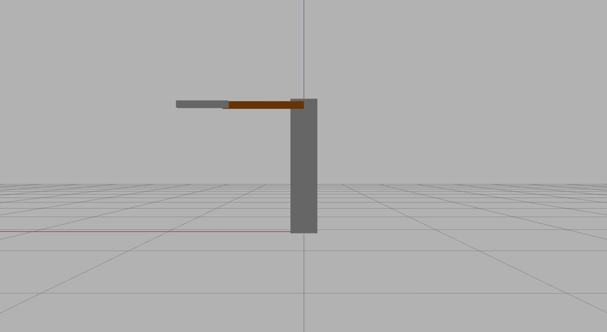

## Two-link-manipulator

This is a simple catkin package for ```ROS``` with manipulator with 2 joints.



Manipulator uses ```JointPositionController``` to change angle for each joint.

### Available topics to control joint:

###/manipulator/joint1_position_controller/command

Topic used to control first joint using angle (radians). Type: ```Float64```

###/manipulator/joint2_position_controller/command

Topic used to control second joint using angle (radians). Type: ```Float64```
